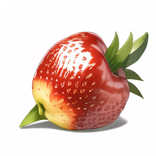
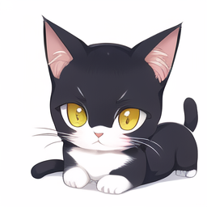

## Novel AI
AI生成图片
### 部署
#### 快速开始
```
# kaggle
https://www.kaggle.com/code/inmine/novelai-with-webui-stable-diffusion-version
# aistudio
https://aistudio.baidu.com/aistudio/projectdetail/4666819?channelType=0&channel=0
```
### 设置
参考推荐设置 迭代步数 30  采样方法 Euler a
### 样例
```
水果
fruit,avator,simple background
```

```
动物
cat,cute,big eye,avator,white background
mouse,cute,big eye,avator,white background,abstract painting style
baby chicken,cute,lovely,big eye,avator,white background,abstract painting style
baby fox,cute,lovely,happy,big eye,colorful,avator,white background,abstract painting style
# 像素 pixel art
baby panda,cute,lovely,happy,big eye,colorful,avator,white background,pixel art
# 现实阴影 realistic shadows
baby panda,cute,lovely,happy,big eye,colorful,avator,white background,realistic shadows
```

```
人物
masterpiece, best quality,Exquisite details tiara,Exquisite detail eyes，Exquisite detail eyeshadow,((The main color is white)),((The auxiliary color is light blue)),The auxiliary color is pink
```


### 参考文章
- [NovelAI 案例说明](https://www.yuque.com/longyuye/lmgcwy)
- [词汇生成器](https://ai.dawnmark.cn/)
- [Warnning](https://seesaawiki.jp/love-ai/d/R-18)